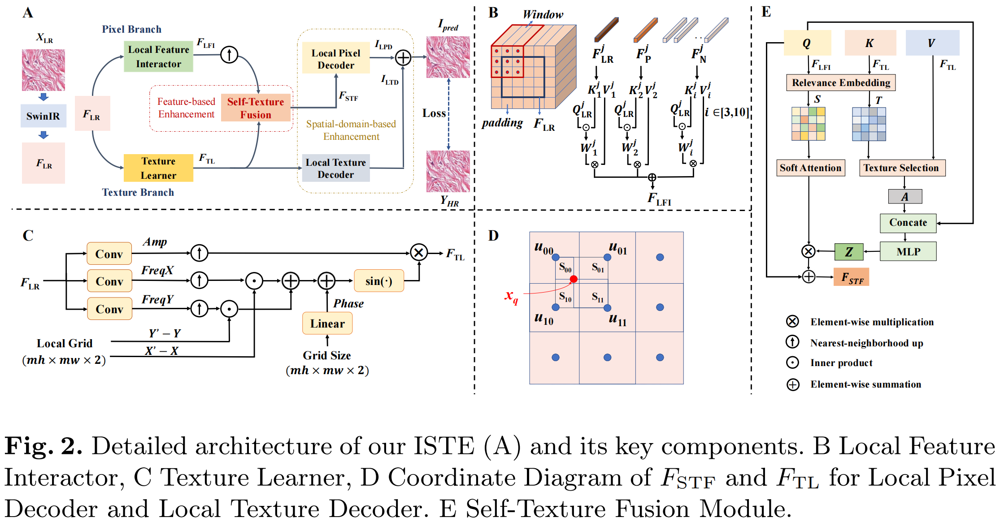

# ISTE

# An Efficient Dual-branch Framework based on Implicit Self-texture Enhancement

[[Paper](https://arxiv.org/pdf/2304.04238.pdf)][[Code](https://github.com/dmhdmhdmh/ISTE.git)]

## Dependencies
* numpy==1.23.4
* scikit_image==0.19.2
* torchvision==0.15.1
* torch==2.0.0
* pytorch-fid==0.2.1
* opencv-python==4.6.0.66

## Train & Test

### **SwinIR-ISTE**

**Train**: `python train.py --config configs/train/train_swinir-iste.yaml --gpu 0,1,2,3`

**Test**: `python test.py --config configs/test/test-histo-2.yaml --model save/_train_swinir-iste/epoch-last.pth --window 8 --gpu 0`
